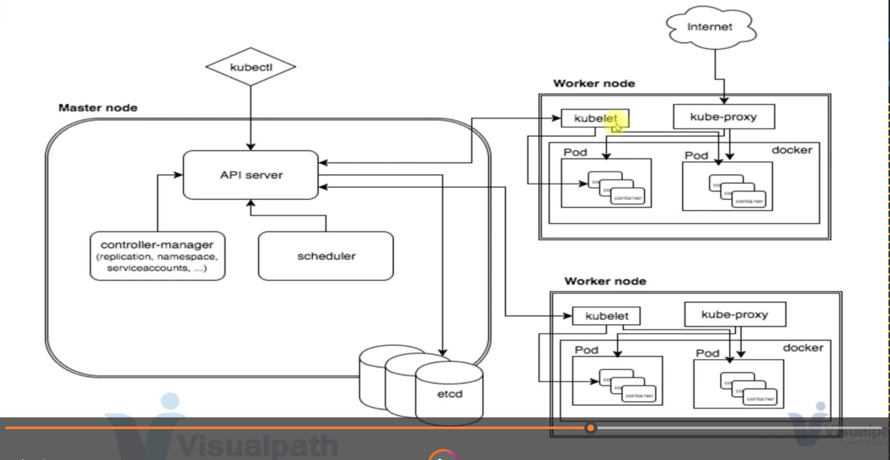

# Day 001

## Introduction

Had knowledge of Kubernetes in the past but went out of practice so now have decided to restart from scratch.
Studied about the history of Kubernetes aka K8s then went on to learning its various usecases and what are the different terminologies such as Master Node, Worker Node etc. 

[Tweet](https://twitter.com/TusharC29050031/status/1673387007634972672?s=20)