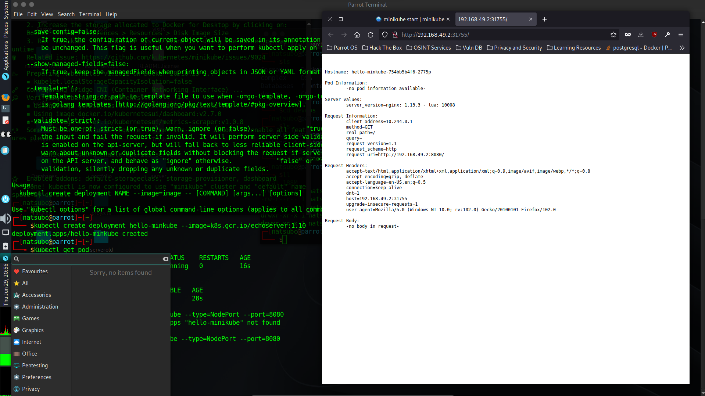

# Day 003

## Introduction

Played around with minkube and created deployments and exposed them to services using 'kubectl create deployment' and 'kubectl expose' cmds

[Tweet](https://twitter.com/TusharC29050031/status/1674441572073582607?s=20)