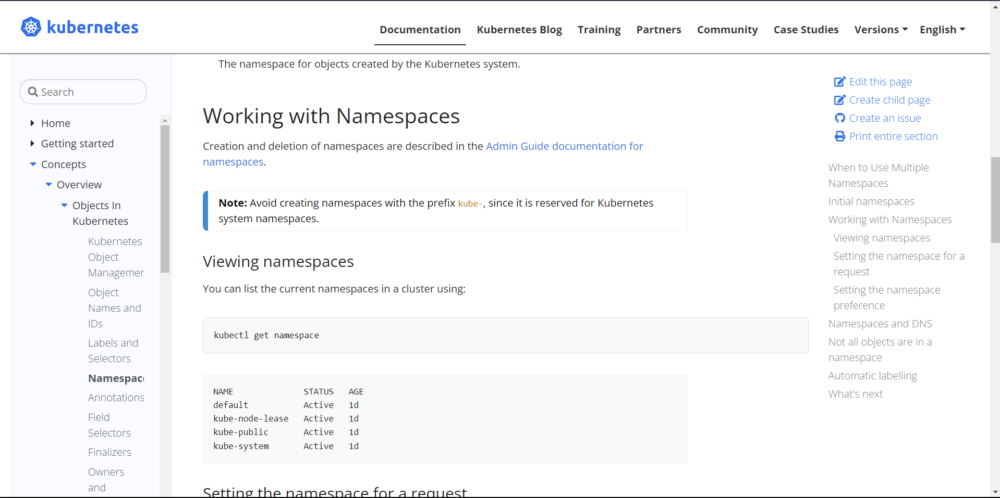

# Day 006

## Introduction

Got familiar with K8s namespaces which provides a mechanism for isolating groups of resources within a single cluster. And also created a simple yaml file for creating a pod containing a nginx image.

[Tweet](https://twitter.com/TusharC29050031/status/1675561674357473280?s=20)

