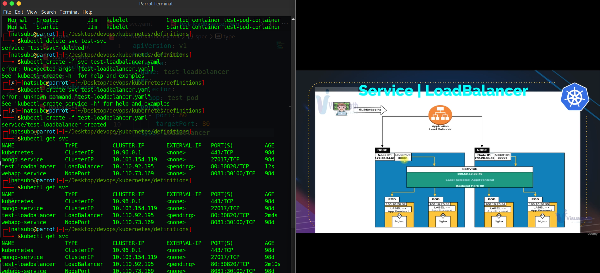

# Day 009

## Introduction

Took a deep dive into Services types in K8s like NodePort, ClusterIP & Load Balancer. Created few test services as well to understand these and got hold of their usecases. 

[Tweet](https://twitter.com/TusharC29050031/status/1676613077205151745?s=20)

