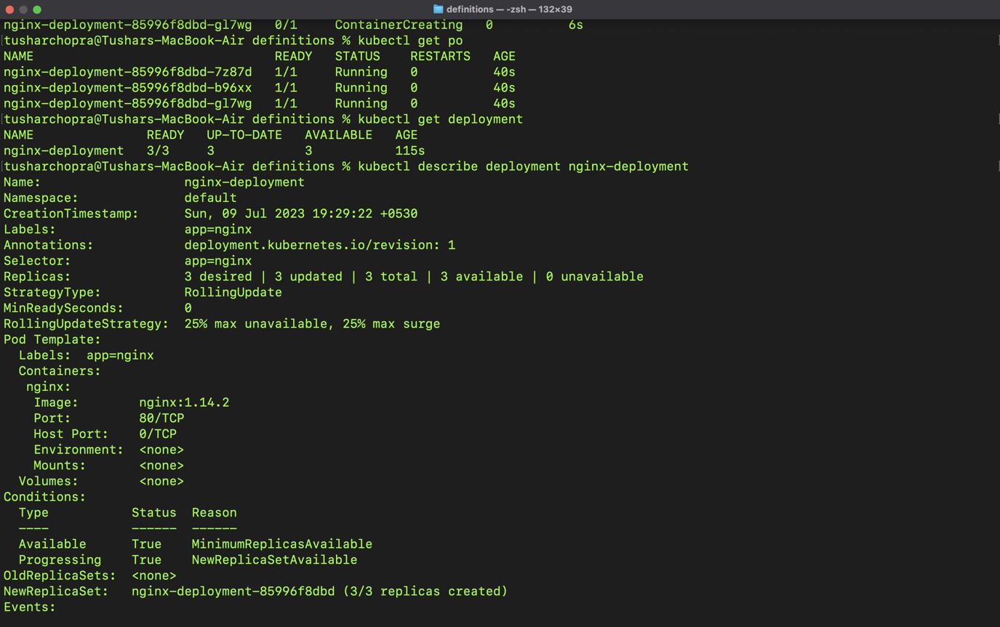

# Day 011

## Introduction

Studied about one of the most important topic in K8s, ie Deployments. A Deployment provides declarative updates for Pods and ReplicaSets.
Also learnt the difference between cmd and arg for a container.

[Tweet](https://twitter.com/tusharc29050031/status/1678049629949292547?s=61&t=dNj81q_jeHzmyslY6xKUmQ)

