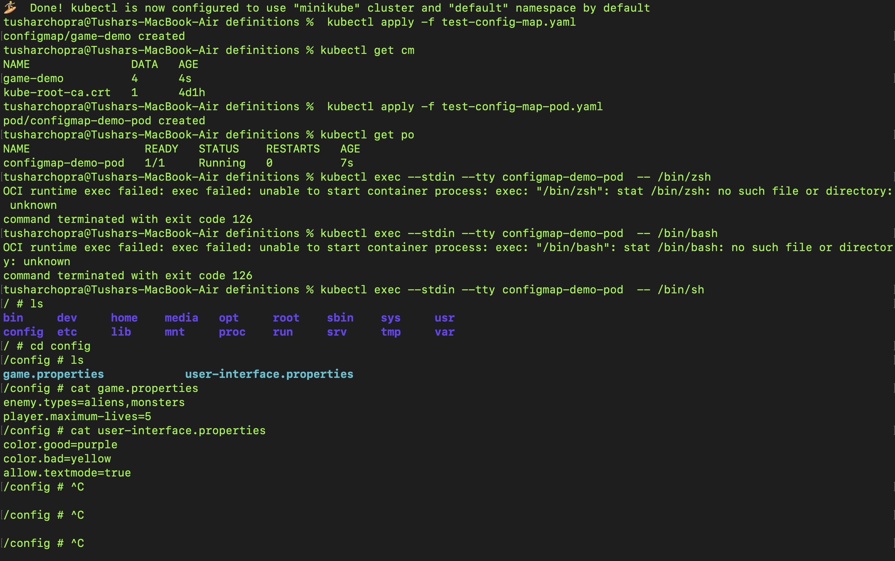

# Day 013

## Introduction

Started off with completing a simple slack age bot made using Golang. Studied about Config Maps and ENVs today in K8s. Wherein a ConfigMap is an API object used to store non-confidential data in key-value pairs

[Tweet](https://twitter.com/tusharc29050031/status/1678817578204950539?s=61&t=1Q6OpvwRqc8HkeWBuMwf4w)

