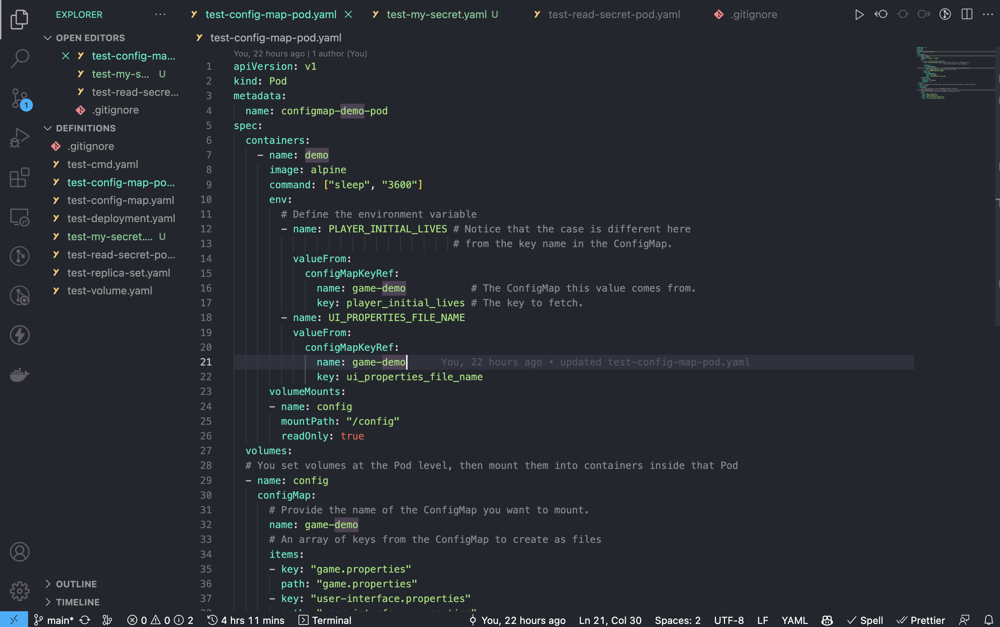

# Day 014

## Introduction

So today I got familiar with Secrets one of the most crucial aspect in almost all scopes of programming. There are various types and ways in which secrets can be utilised in K8s. 

[Tweet](https://twitter.com/tusharc29050031/status/1679155759488139264?s=61&t=sDJkEXlUCu8yEsAFGbq46A)

