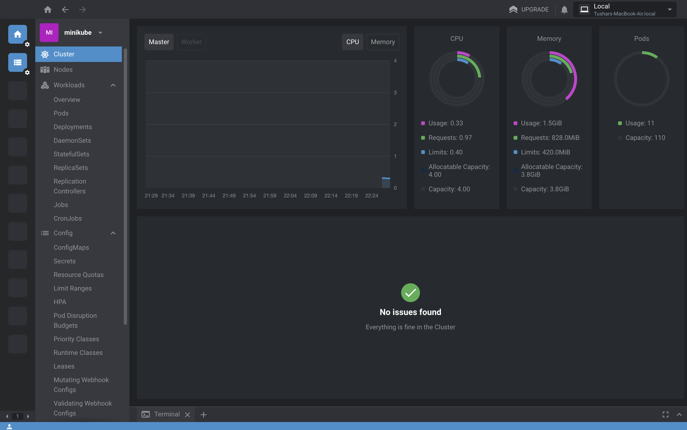

# Day 016

## Introduction

Learnt about the official kubectl cli & cheatsheet. Practiced few of the commands there. Also got hands on with Lens which is the most used IDE when it comes to K8s

[Tweet](https://twitter.com/tusharc29050031/status/1679899506614186007?s=61&t=W9t3PsSqsijuJ-OYKFP2sQ)

