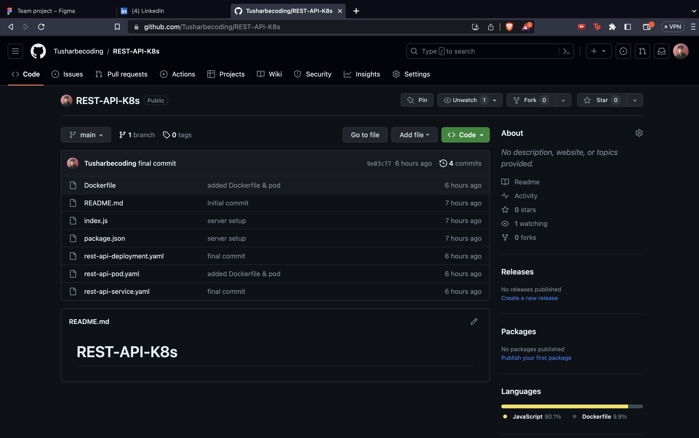

# Day 018

## Introduction

Completed a little hands on project of creating and deploying a REST API using Node & Kubernetes. Used Docker for creating image and container. Plus started developing a Github stats cli using Golang. 

[Tweet](https://twitter.com/tusharc29050031/status/1681373354278699012?s=61&t=XgEYt_GC7LrWr6o11nuWEA)

