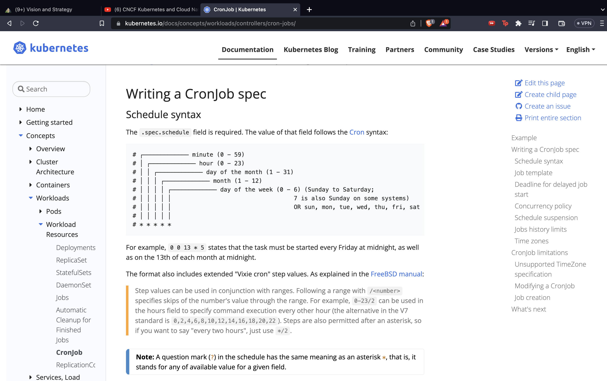

# Day 022

## Introduction

Learnt about CronJobs and their various use cases. CronJob is meant for performing regular scheduled actions such as backups, report generation, and so on. 

[Tweet](https://twitter.com/tusharc29050031/status/1683202668905283584?s=61&t=zcSvKPJFEeXECfRRPY_vbA)

